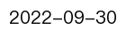
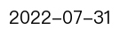
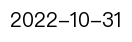

#### 目前更新是一个季度的延迟

|Sector|Lastest_Date|Description|
|:-:|:-:|:-:|
|**[Aviation](./data/Aviation/)**||这个部门因为GDP是季度更新 所以最慢 一个季度延迟|
|**[Ground Transport](./data/Ground_Transport/)**||汽车保有量更新的慢（应该是一年延迟）缺失的年份ratio用线性推|
|**[Industry](./data/Industry/)**||类型ratio并不知道如何得到的 并且我记得之前提过一次 类型并不全 两个月延迟|
|**[Power](./data/Power/)**||排放因子按照之前推的2021和2022年的|
|**[Residential](./data/Residential/)**||供热面积从2021年开始没有数据 用的线性推的 效果不错|
